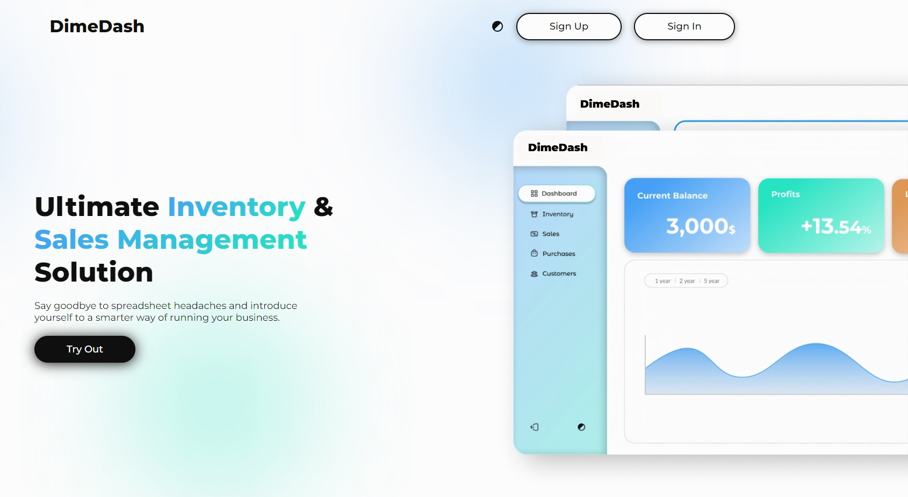
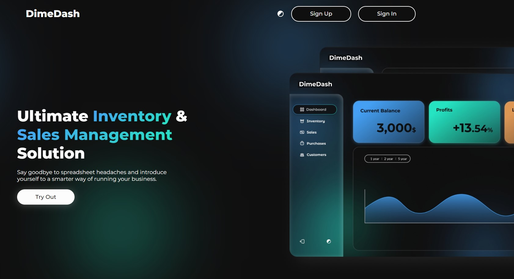
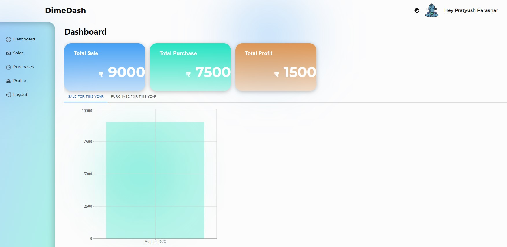
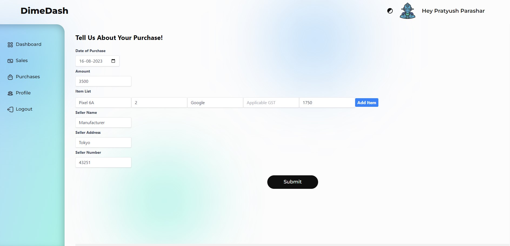
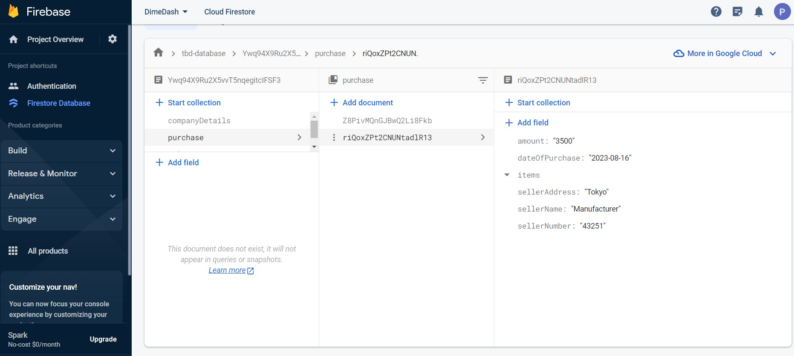
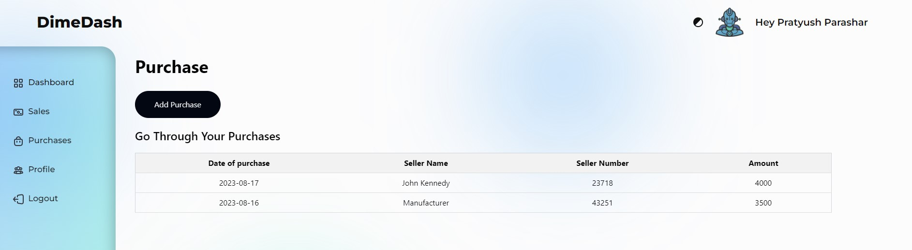
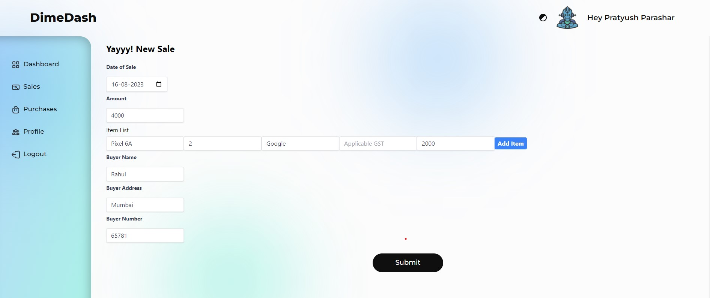
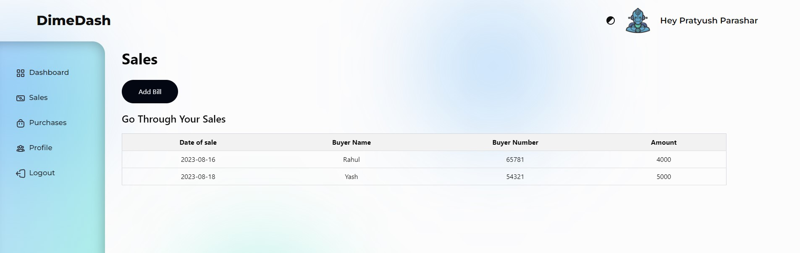

# DimeDash
## Redefining Finance, One Dime at a Time

DimeDash emerges as a transformative accounting web application, engineered to optimize business financial operations. With a robust set of features and an intuitive user interface, it simplifies complex accounting realms, making tasks more streamlined and efficient.

At the heart of its capabilities is a revolutionized approach to inventory management. DimeDash dispenses with tedious manual entries and exhaustive stock checks. Input is effortless, and its real-time tracking maintains accuracy, facilitating strategic stock decisions. Beyond inventory, DimeDash offers a lens into sales performance, illuminating trends and peak periods. These insights are pivotal for informed business strategies and operational efficiency.

Moreover, the platform simplifies billing, ensuring precision and minimizing errors. But DimeDash is more than just a tool—it's a strategic partner. Its analytics provide a deep dive into key performance indicators, highlighting bestsellers and customer behaviors. As businesses harness these insights, they're not just functioning but thriving, positioning DimeDash as an indispensable asset in the modern financial management ecosystem.

## Challenges

During our project, we faced significant hurdles integrating Firestore and Firebase due to their intricate architectures. As novice web developers, understanding these systems was demanding. Moreover, remote collaboration, with team members dispersed across locations, posed communication challenges. Delays and miscommunications occasionally hampered our progress. To counter this, we initiated regular video chats and prioritized clear communication, ensuring better teamwork and efficiency.

Additionally, balancing several concurrent tasks demanded adept time management. We adopted agile frameworks, segmenting tasks and setting feasible deadlines. Despite the challenges, we viewed the project as a valuable learning experience. Our resilience and adaptability were key in navigating these obstacles.

## Snapshots

### Home Page in Light Mode

 

### Home Page in Dark Mode

### Dashboard for Visualization of Sales and Purchase History

### Details required for Purchase Entry

### Details being stored in Firestore Database

### Purchase History along with Relevant Details

### Details required for Sale Entry

### Sale History along with Relevant Details

## Getting Started

### Access via Hosted Website

DimeDash Website Link: [https://dime-dash.vercel.app/]([https://dime-dash.vercel.app/])

### Access via Local Host

Clone the repository and make sure that `node.js` is installed in the system. Navigate to the project directory and run the following commands sequentially:

#### `npm install`

This command is used to install packages and dependencies for your project from the npm registry. It adds the specified packages to your project's node_modules directory and updates the package.json file to include these dependencies.

#### `npm start`

This command initiates the application in development mode. It automatically opens the application in your default web browser at http://localhost:3000, allowing you to view and interact with it as you work on your project.

